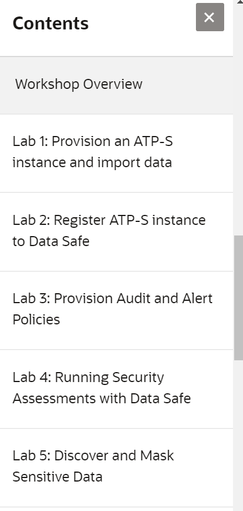

# Data Safe Workshop (PTS) #

## Workshop Overview ##

This workshop allows you to discover the features of Data Safe and use them to manage security features in an Autonomous Database.

## Workshop Requirements

To complete this lab, you need to have the following:
* Login credentials and a tenancy name for the Oracle Cloud Infrastructure Console
* A compartment enabled with permission to create and use resources
* Demo data files employees.csv and emp_extended.csv

## Agenda

Specify the labs (and a longer explanation of the labs) here. Example:

- **Lab 0 :** Setup the Lab Environment

This lab introduces the student lab environment and contains the steps to setup the student desktop for connecting to the lab virtual machine.

- **Lab 1 :** First lab title

This section describes the content of the lab. You can explain a bit what it will do and what to end-goal is.

- **Lab 2 :** Second lab title

This section describes the content of the lab. You can explain a bit what it will do and what to end-goal is.

- **Lab 3 :** Third lab title

This section describes the content of the lab. You can explain a bit what it will do and what to end-goal is.

- **Lab 4 :** Fourth lab title

This section describes the content of the lab. You can explain a bit what it will do and what to end-goal is.

## Access the labs ##

- Use **Lab Contents** menu on your right to access the labs.
    - If the menu is not displayed, click the menu button  on the top right  make it visible.

- From the menu, click on the lab that you like to proceed with. For example, if you like to proceed to **Lab 0**, click **Lab 0: Setup the Lab Environment**.

- You may close the menu by clicking 

## Acknowledgements

- **Author** - Robert Pastijn, Database Product Management, PTS EMEA - April 2020
