# Lab 3 - Provision Audit and Alert Policies #


## Objectives

* Provision audit and alert policies on a target database
* View details for an audit trail in Oracle Data Safe
* Enable a custom audit policy on a target database


## Disclaimer ##

The following is intended to outline our general product direction. It is intended for information purposes only, and may not be incorporated into any contract. It is not a commitment to deliver any material, code, or functionality, and should not be relied upon in making purchasing decisions. The development, release, and timing of any features or functionality described for Oracle’s products remains at the sole discretion of Oracle.

## Requirements ##

To complete this lab, you need to have the following:
* Login credentials and a tenancy name for the Oracle Cloud Infrastructure Console
* A compartment enabled with permission to create and use resources
* The ATP-S instance provisioned in Lab 1
* The access privileges configured in Lab 2

## STEP 1: Provision audit and alert policies on a target database by using the Activity Auditing wizard

In the Oracle Data Safe Console, click the **Home** tab, and then click the **Activity Auditing** tab.

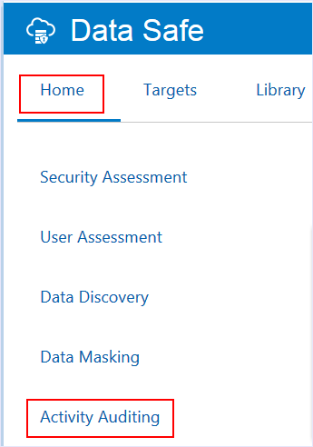

On the **Select Targets for Auditing** page, select the check box for your target database, and then click Continue.

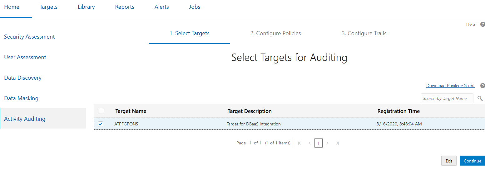

On the **Retrieve Audit Policies** page, select the check box for your target database, and then click **Retrieve** to retrieve the audit policies for your database. Wait until a green check mark is displayed in the Retrieval Status column, and then click **Continue**.

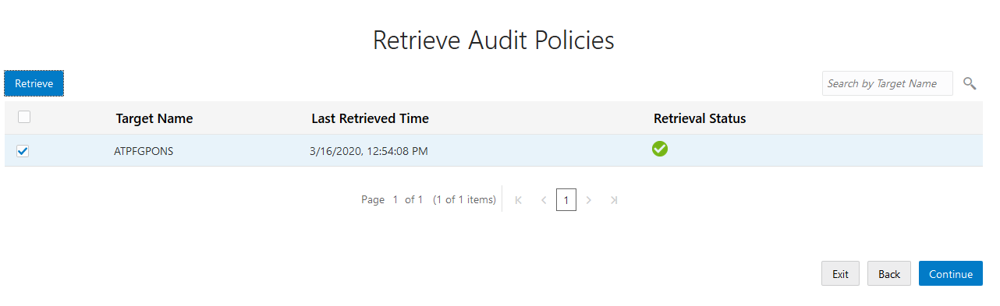

The check mark means that all of the audit policies are successfully retrieved.

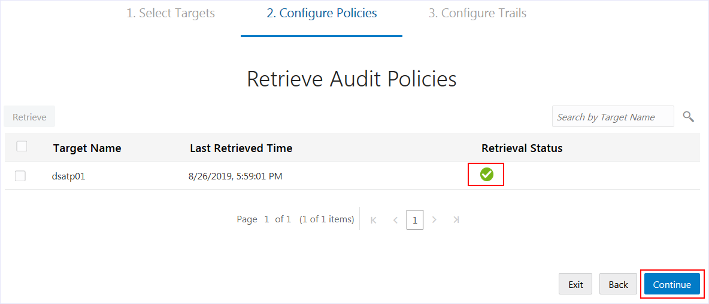

On the **Review and Provision Audit and Alert Policies** page, review the types of audit policies already enabled on your target database, and then click your target database name to provision more policies.

The check marks under **Additional Policies** means that the Autonomous Transaction Processing (ATP) database has predefined audit policies enabled.

Currently, there are no basic, admin activity, or user activity audit policies provisioned on your database, nor are there any alert policies.

Click on the name of your database to open the Edit Policies dialog box.

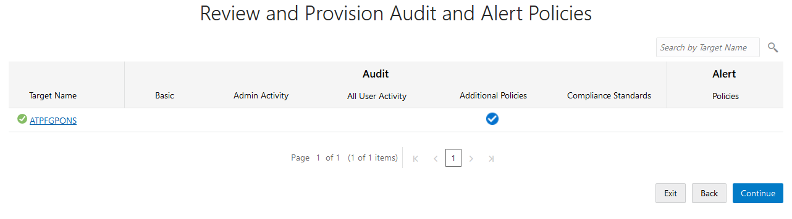

On the **Audit Policies** tab in the Edit Policies dialog box, notice that the following Basic Auditing and Admin Activity Auditing policies are selected by default. Oracle recommends that you provision these policies. They are not provisioned by default.

*	Critical Database Activity
*	Login Events
*	Database Schema Changes (DDL)
*	Admin Activity

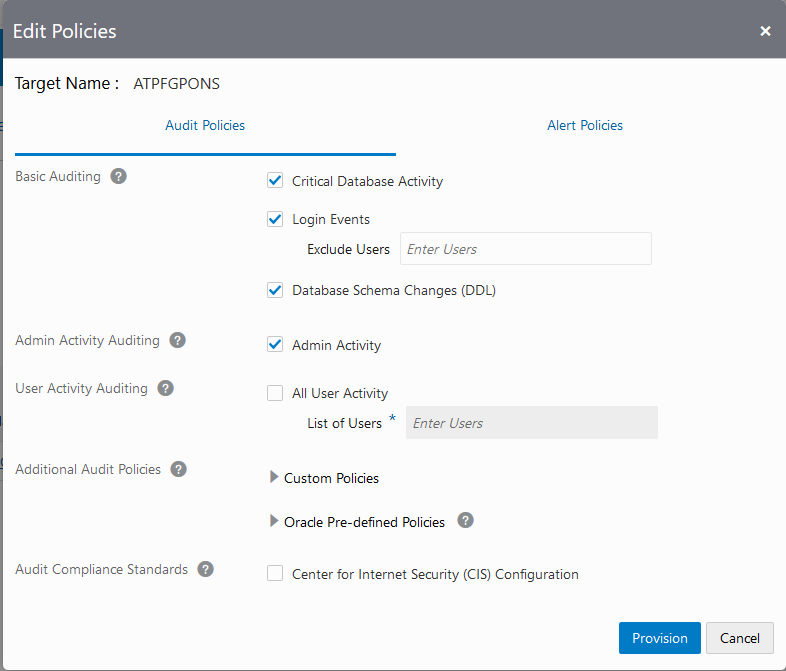

Expand Oracle Pre-defined Policies to view the list of Oracle predefined audit policies available on your ATP database. By default, the following policies are provisioned:

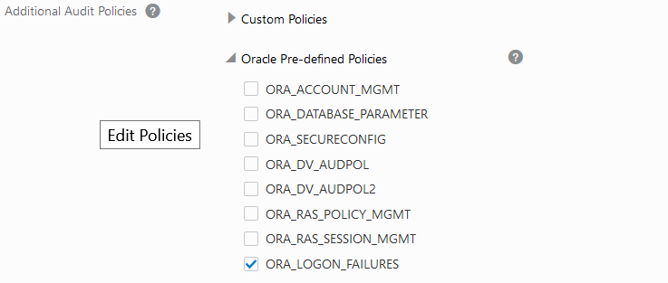

Provision additional policies

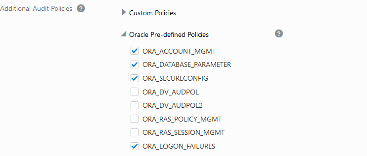

Notice that the Center for Internet Security (CIS) Configuration policy is not provisioned and enabled by default. Check to enable it, then click **Provision**.

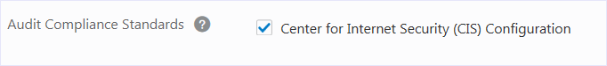

You can click the **Alert Policies** tab to review the selected alert policies.

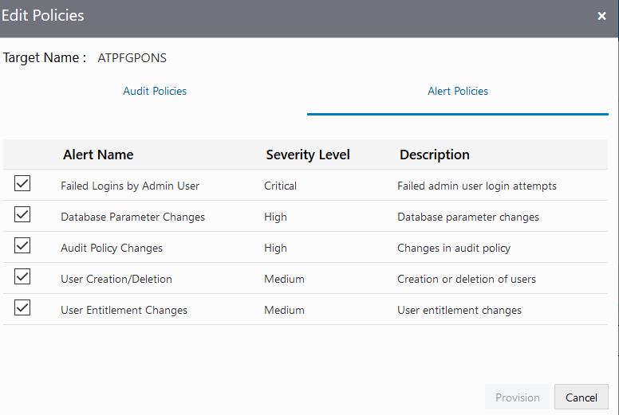

On the **Review and Provision Audit and Alert Policies** page, wait for check marks to appear under all audit policy types, except for All User Activity, and then click **Continue**.

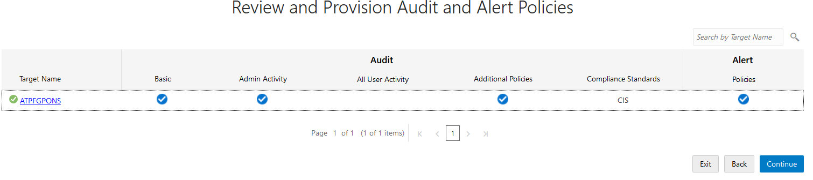

On the **Start Audit Collection** page, notice the following defaults:

*	The audit trail location is automatically set to UNIFIED_AUDIT_TRAIL
*	Audit collection is not yet started.
*	The auto purge feature is enabled.

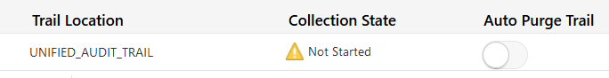

Select your database and click **Start** to start collecting audit data.

A message at the top of the page states the **UNIFIED_AUDIT_TRAIL** is successfully created.

The Collection State column indicates that collection is **LOADING**, then **STARTING**, and then **COLLECTING**.

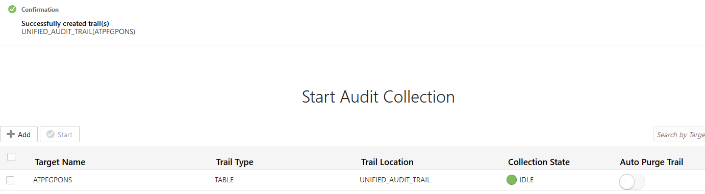

While the audit data is being collected, click **Done**.

## STEP 3: Execute some account management activity on the database

Using SQL Developer as user **ADMIN**, execute the following statements:

````
<copy>
create user bob identified by "OraclePTS#2020";
grant DWROLE to bob;
drop user bob;
</copy>
````

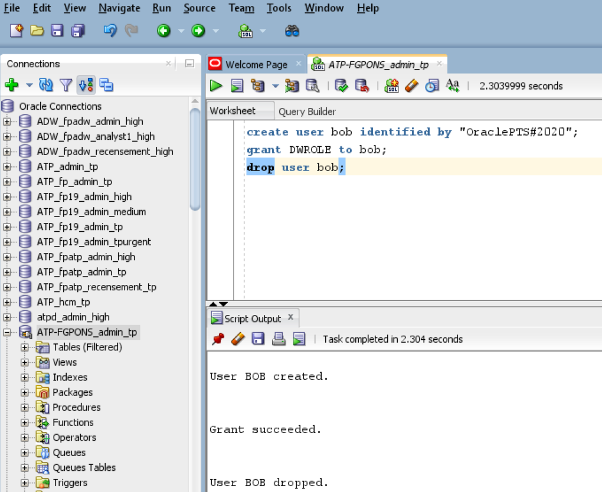

## STEP 4: View audited activity in Data Safe

Connect to the Data Safe console.

Click on the **Reports** tab.

In the **Auditing Activity** category on the left hand side, select the **All Activity** report.

The user creation records are shown after one or two minutes:

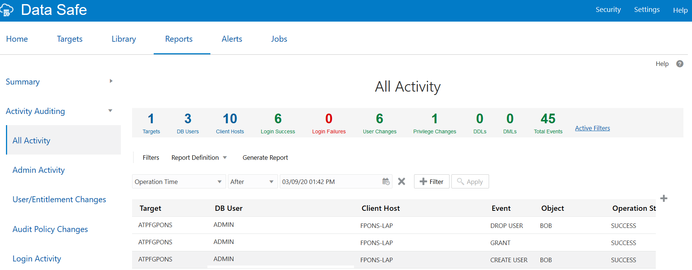

Continue with Lab 4.

## Acknowledgements ##

- **Author** - Oracle Database Product Management, PTS EMEA - April 2020
