# Lab 5 - Discover and Mask Sensitive Data   #

## Objectives

*	View sensitive data in your Autonomous Transaction Processing (ATP) database
*	Discover sensitive data by using Data Discovery
*	Mask sensitive data by using Data Masking
*	Validate the masked data in your ATP database

## Disclaimer ##

The following is intended to outline our general product direction. It is intended for information purposes only, and may not be incorporated into any contract. It is not a commitment to deliver any material, code, or functionality, and should not be relied upon in making purchasing decisions. The development, release, and timing of any features or functionality described for Oracle’s products remains at the sole discretion of Oracle.

## Requirements ##

To complete this lab, you need to have the following:
*	Login credentials and a tenancy name for the Oracle Cloud Infrastructure Console
*	A compartment enabled with permission to create and use resources
*	The ATP-S instance provisioned in Lab 1

## STEP 1: Discover sensitive data by using Data Discovery

The Data Discovery wizard generates a sensitive data model that contains sensitive columns in your target database. When working in the wizard, you select sensitive types that you want to discover in your target database.
From the OCI navigation menu, select Data Safe.

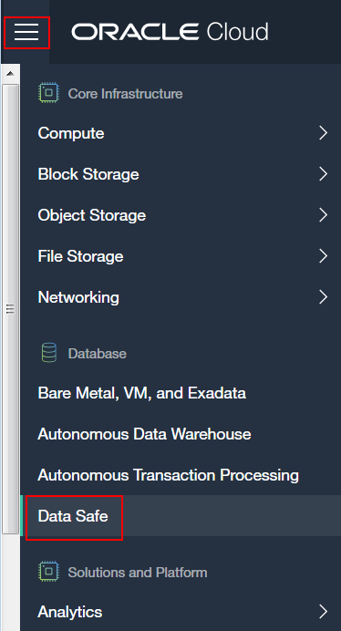

Click Service Console.

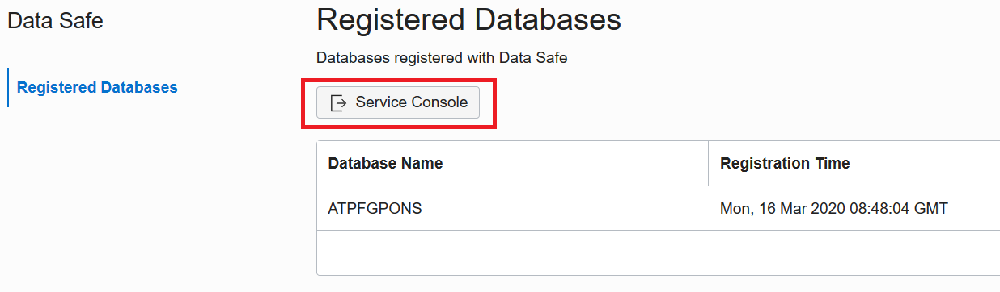

Sign in to Oracle Data Safe using your Oracle Cloud Infrastructure credentials.
The **Home** tab is displayed when you first sign in to Oracle Data Safe.
Access the Data Discovery wizard by clicking the **Data Discovery** tab.

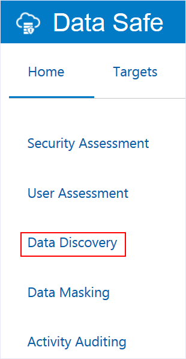

On the Select Target for Sensitive Data Discovery page, select your target database, and then click Continue.

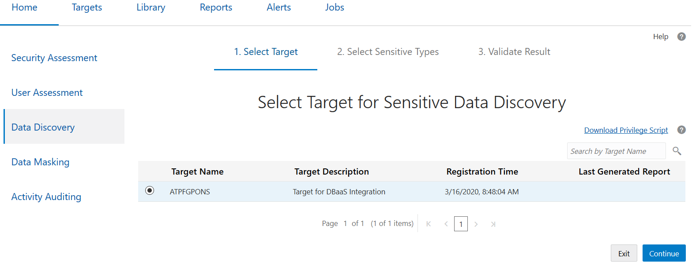

On the Select **Sensitive Data Model** page, leave **Create** selected, enter **SDM_HCM** for the name, enable **Show and save sample data**, select the default Resource Group, and then click **Continue**.

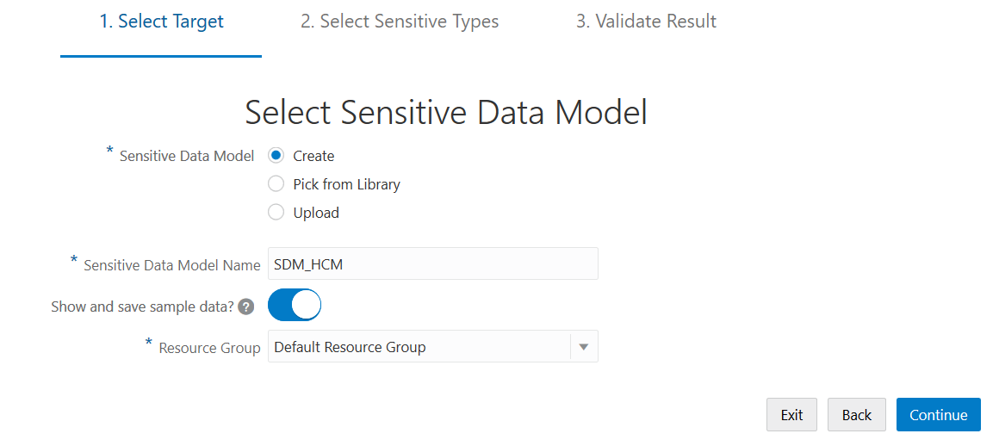

On the **Select Schemas for Sensitive Data Discovery** page, scroll down and select the **HCM** schema, and then click **Continue**.

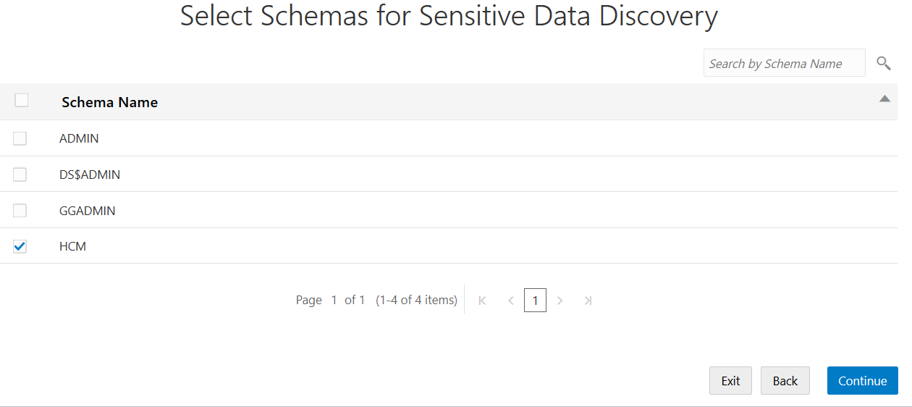

On the **Select Sensitive Types for Sensitive Data Discovery** page, expand all of the categories by moving the slider to the right, and then scroll down the page and review the sensitive types. Notice that you can select individual sensitive types, sensitive categories, and all sensitive types.

At the top of the page, select the **Select All** check box, and then click **Continue** to start the data discovery job.

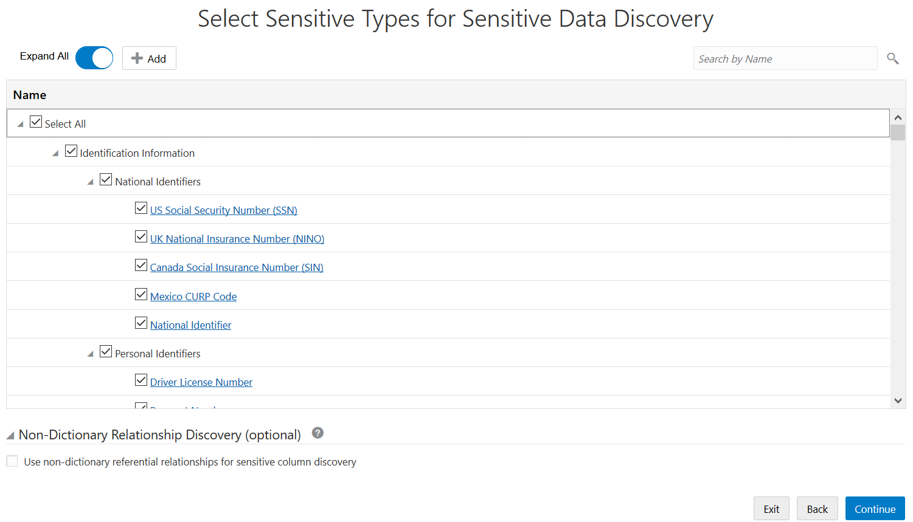

When the job is completed, ensure that the **Detail** column states Data discovery job finished successfully, and then click **Continue**.

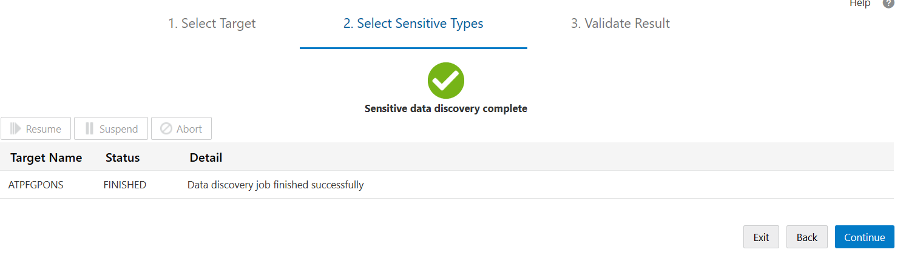

On the **Sensitive Data Discovery Result** page, examine the sensitive data model created by the Data Discovery wizard. To view all of the sensitive columns, move the **Expand All** slider to the right.
Oracle Data Safe automatically saves your sensitive data model to the Oracle Data Safe Library.

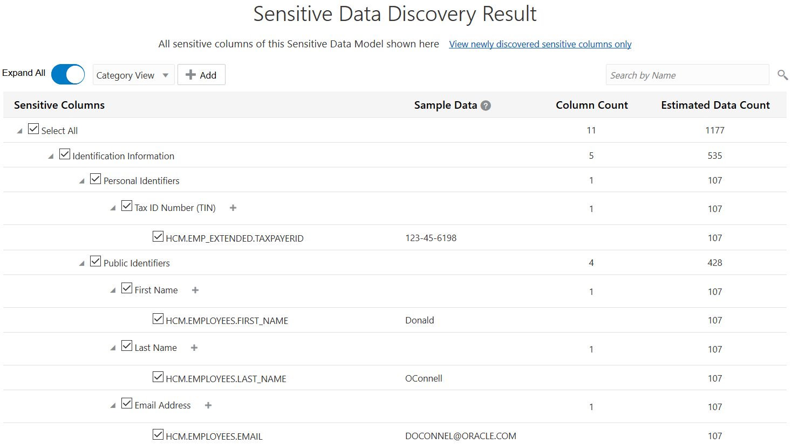

From the drop-down list, select **Schema View** to sort the sensitive columns by table.

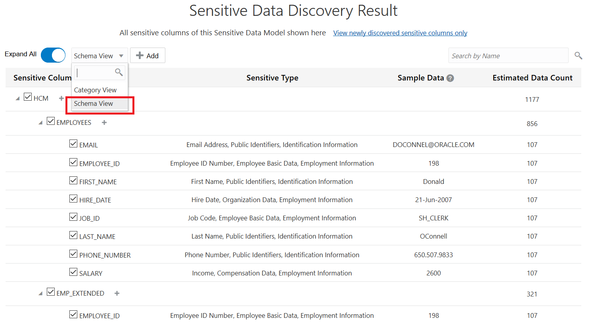

Scroll down the page to view the sensitive columns.
You can view sample data (if it's available for a sensitive column), column counts, and estimated data counts.
In particular, take a look at the sensitive columns that Data Discovery found in the **EMPLOYEES** table. Columns that do not have a check mark are called referential relationships. They are included because they have a relationship to another sensitive column and that relationship is defined in the database's data dictionary.
Also view the sample data provided to get an idea of what the sensitive data looks like.

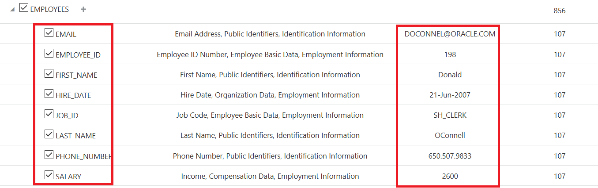

Scroll to the bottom of the page, and then click **Report** to view the Data Discovery report.
The chart compares sensitive categories. You can view totals of sensitive values, sensitive types, sensitive tables, and sensitive columns.
The table displays individual sensitive column names, sample data for the sensitive columns, column counts based on sensitive categories, and estimated data counts.

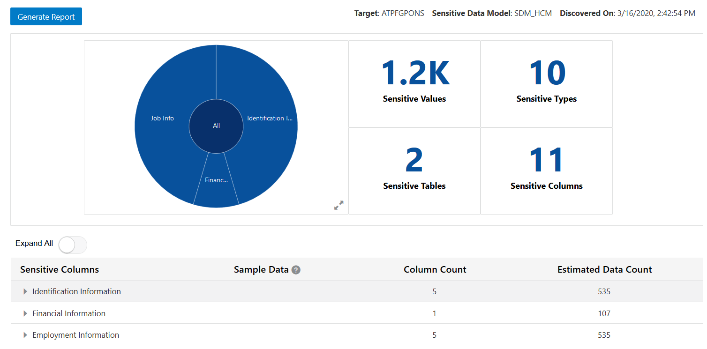

Click the chart's Expand button.

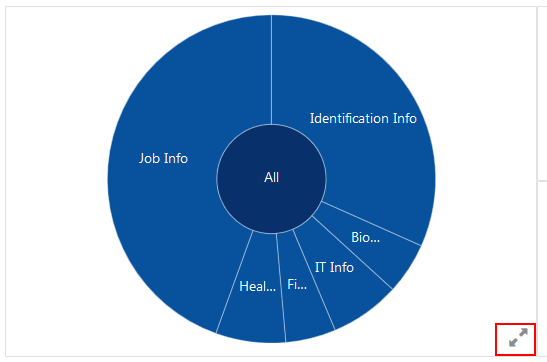

Position your mouse over **Identification Info** to view statistics.

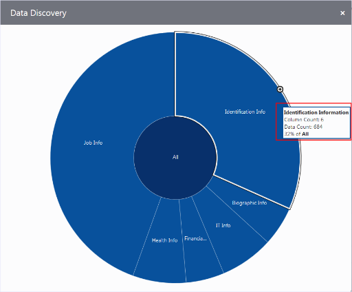

With your mouse still over **Identification Info**, click the **Expand** button to drill down.

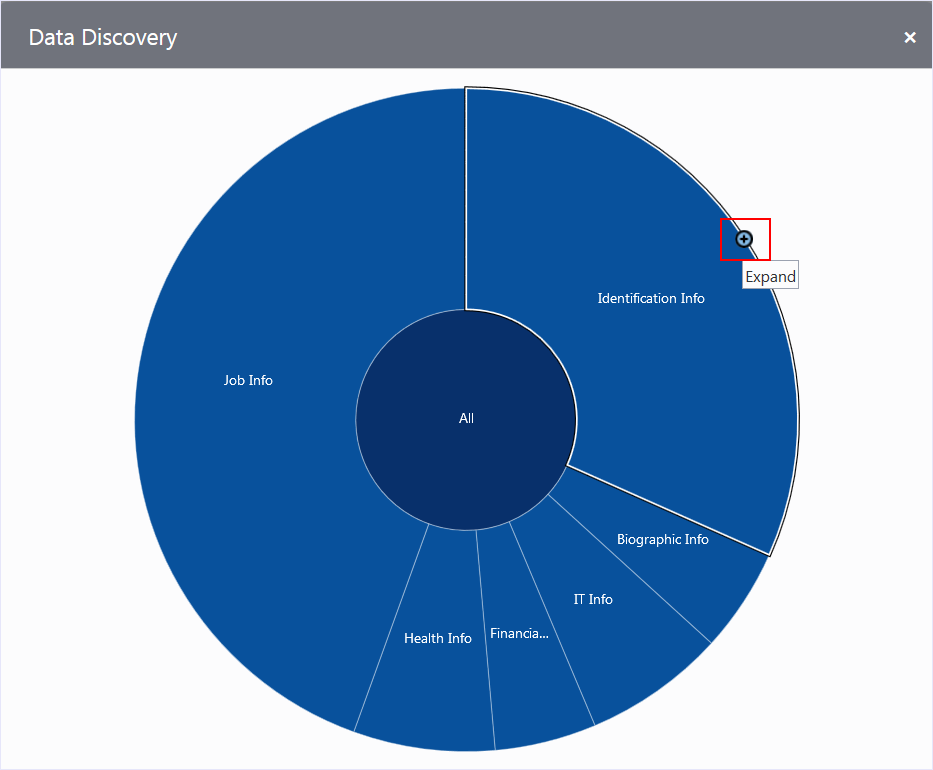

Notice that the **Identification** Info category is divided into two smaller categories (**Personal IDs** and **Public IDs**). To drill-up, position your mouse over an expanded sensitive category, and then click the **Collapse** button.

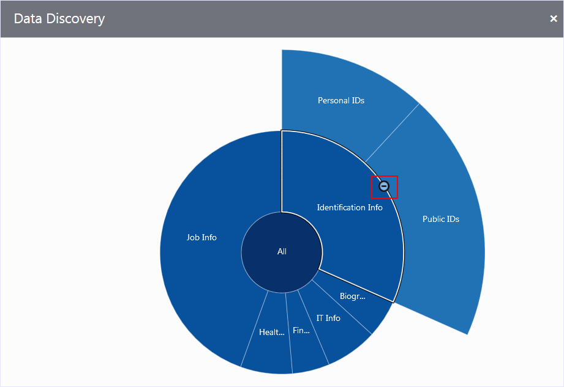

Click the **Close** button (**X**) to close the expanded chart. Do not exit the wizard.

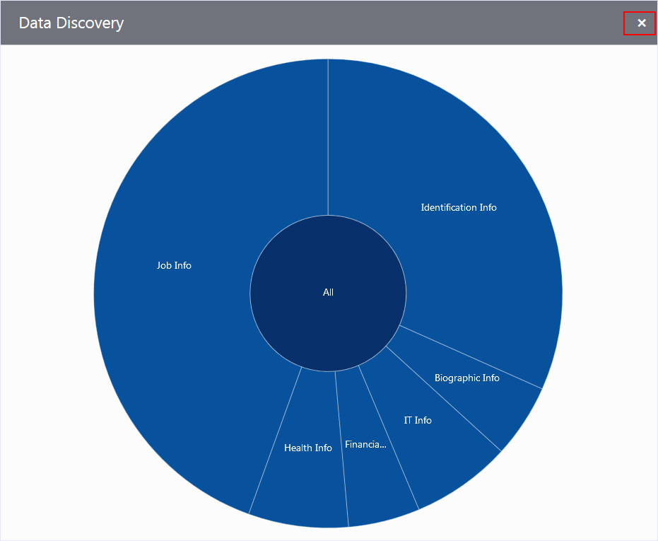

## Acknowledgements ##

- **Author** - François Pons, Database Product Management, PTS EMEA - April 2020
